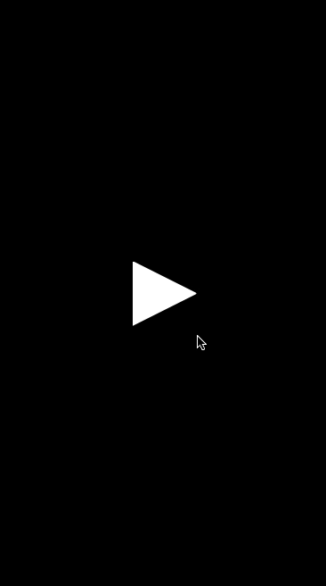

AnimatablePlayButton
========================

[](https://github.com/Carthage/Carthage)
[](http://cocoadocs.org/docsets/AnimatablePlayButton)
[](https://developer.apple.com/swift/)

Animated Play and Pause Button written in Swift, using CALayer, CAKeyframeAnimation.



## features
- Only using CAShapeLayer, CAKeyframeAnimation. not from image object.

## Requirements
- iOS 8.0+
- Swift 2.0+
- ARC

##Installation

####CocoaPods
available on CocoaPods. Just add the following to your project Podfile:
```
pod 'AnimatablePlayButton'
use_frameworks!
```

####Carthage
To integrate into your Xcode project using Carthage, specify it in your Cartfile:

```ogdl
github "suzuki-0000/AnimatablePlayButton"
```

## How to use
See the code snippet below for an example of how to implement.
example project would be easy to understand.

#### 1. Create a button, specify backgroundColor of Button(bgColor), and button color(color).
```swift
let button = AnimatablePlayButton(frame: CGRectMake(0, 0, 44, 44))
button.bgColor = .blackColor()
button.color = .whiteColor()
self.view.addSubview(button)
```

#### 2. Add tapped function
```swift
button.addTarget(self, action: Selector("tapped:"), forControlEvents: .TouchUpInside)
```
```swift
func tapped(sender: AnimatablePlayButton) {
    if sender.selected {
        sender.deselect()
    } else {
        sender.select()
    }
}
```

## License
available under the MIT license. See the LICENSE file for more info.

